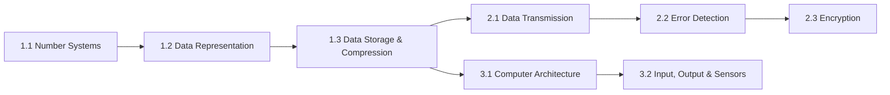

# Game Design Document

## New teaching game — synthesised from Binary Mine, Hex Machine and Pseudocode Farmer

Bloomsbury Computing, Cambridge IGCSE 0478 / Lower Secondary 0860

---

## 0. Why this document exists

The three existing games (`BinaryMine/`, `HexMachine/`, `PseudocodeFarmer/`) were each built
independently, but on close reading they share one real design philosophy, expressed three
different ways: **a genuine idle/incremental economy where the only way to advance is to
correctly do the actual exam skill**, not a quiz bolted onto a game. This document:

1. Records exactly how each existing game works mechanically (Section 1), verified by
   reading their source directly, not from memory.
2. Extracts the design principles that make them work (Section 2).
3. Proposes a new game (Section 3 onward) that deliberately borrows and recombines pieces
   of all three, rather than cloning any one of them.

**This document proposes something new. It does not describe changes to Binary Mine, Hex
Machine or Pseudocode Farmer, and none of their code is touched by this plan.**

---

## 1. The three existing games, mechanic by mechanic

### 1.1 Binary Mine — `BinaryMine/index.html` + `binary-mining-module.js`

*Teaches: binary addition (Year 8 Binary L3).*

- **World**: a 2D Minecraft-styled grid — a few "sky" rows to build on, and mine rows below,
  each showing a hidden numeric value per block, skinned as a periodic-table element (real
  elements 1–118, then procedurally-named "synthetic" elements beyond that).
- **The core verb is `value`.** Every item in the game — ore block, inventory item, pickaxe —
  is nothing but a positive integer. There is no separate "currency" system layered on top;
  money is just another integer you get by *selling* an item.
- **Mining is gated by a real rule, not a level number:** you can mine a block of value `V`
  only if you *own* an item that is either exactly `V`, or whose bit-length is at least
  `bits(V) + 2` ("brute force" — a strong enough tool overpowers a weaker block outright).
  This is taught explicitly: the game shows a 🔒 on blocks you can't yet mine.
- **Crafting is binary addition, shown as scaffolding, not asked as an abstract sum.**
  Dragging two owned items into slots A and B lays out a real column-addition grid (place
  values, a togglable carry row, a togglable answer row) and the player must produce the
  *actual bit pattern* of `A + B`, not just a decimal answer — clicking `0`/`1` cells one at a
  time. Crafting is only accepted when `parseInt(playerBits, 2) === a + b` *and* it **consumes**
  both inputs (binary addition conserves value — nothing is created for free; mining is the
  only source of genuinely new value).
- **Hints are recipes, not answers.** Failing to mine a block opens a hint panel listing every
  known `(a, b)` pair that sums to that block's value, sorted by whether the player already
  owns both ingredients, and pre-fills the craft slots on click — but the player still has to
  do the addition themselves.
- **Economy loop**: mine → (mine again, or craft a bigger pickaxe from two owned items) →
  sell for money → spend money to "dig deeper" and unlock a new, harder mine row (deterministic
  per-row value band, seeded so every player sees the same world) → repeat. A shop lets you
  buy back anything you've sold, at 2× the sale price, so selling isn't a one-way trap.
- **Soft loss state, not a hard game over normally**: a "hard lock" (nothing mineable, fewer
  than 2 items to craft with, can't afford to dig, can't afford any buyback) triggers a
  Game Over screen with a full reset option — deliberately rare by design, but present.
- **Meta systems shared with the site**: a class leaderboard (Firebase, privacy-scoped to
  `{class}/{opaque login code} → {money, best}`, never a name or email), Google Drive
  save/load with a tamper-evident signature (SHA-256 of a baked secret + payload — not real
  security, just enough to say "don't hand-edit this"), and a "Load names" flow that
  pulls the class code→name mapping locally for leaderboard display only.
- **No admin dashboard progress reporting** — it is explicitly a sandbox, and the lesson step
  auto-completes on mount rather than being gated on any in-game achievement.

### 1.2 Hex Machine — `HexMachine/index.html` (Matter.js for cable physics)

*Teaches: hex↔binary conversion, binary addition, hex-digit grouping.*

- **World**: a pannable/zoomable canvas with a central "mainframe" and draggable "machine"
  cards, each labelled with a value shown *both* as a hex tier (`0x1F`) and as a custom glyph
  script (a made-up "hieroglyph" alphabet, base-1071, purely cosmetic flavour so numbers don't
  all look like "just hex" — nice texture, no teaching weight).
- **This is a true idle/incremental game**: every machine passively earns `value × (hp/100)`
  money per second, summed across all owned machines, ticking continuously. Health (`hp`)
  degrades when "bugs" attack (see below) and recovers implicitly by... actually it doesn't
  auto-heal — a damaged machine just earns less until repaired/replaced. Buying a new machine
  of a given value costs `18 × value^1.1` (a smooth, ever-steepening cost curve, not a flat
  price), and you can only buy tiers you have already *unlocked*.
- **Unlocking a tier is not something you buy — it's something you earn by merging.** This is
  the teaching core, a genuine three-phase puzzle gate, not a single question:
  1. **Phase 0 (per machine): hex → binary.** Each machine being merged shows its own hex
     digits above an empty grid of bit-toggle buttons, grouped visually in fours — "Convert
     this machine to binary." Locks in only when every bit matches.
  2. **Phase 1 (once all machines are solved): binary addition.** A "Merge Station" appears
     showing every machine's *already-solved* binary rows stacked for column addition, and the
     player fills in the binary **sum** bit by bit. This is real, multi-operand binary
     addition (not restricted to two numbers — see Multi-Chain below), checked by comparing
     the full bit string, not a decimal shortcut.
  3. **Phase 2: binary → hex.** The now-confirmed binary sum is shown above a row of one hex
     digit per nibble, and the player types each hex digit. Only on a full match does the
     merge actually complete — the two (or more) source machines are consumed, a new machine
     spawns with the summed value, and *that value's tier is now unlocked in the shop*, so it
     can be bought directly from then on without ever merging again.
  - Every stage rejects a wrong attempt with a specific, targeted hint (e.g. "recheck each hex
    digit as a group of four bits") and a shake animation, and lets the player just try again
    — no penalty beyond time.
- **"Multi-Chain" — a purchasable upgrade that changes the *shape* of the puzzle itself**,
  not just a power multiplier: tier 0 merges exactly two machines; each paid tier (cost
  `400 × 7^tier`, 5 tiers total) raises the maximum machines that can be merged into a single
  chain by one, so a fully-upgraded player is doing 7-operand binary addition in one go. This
  is a clean example of a monetisable-feeling upgrade that is actually "make the curriculum
  content harder," not a pure numbers-go-up button.
- **A second, independent minigame layer runs concurrently: bug-wave tower defence.**
  Attacks are telegraphed (a banner + timer), then a wave of "bugs" spawns and damages nearby
  machines; the player can buy laser turrets (4 tiers, cost/range/damage/cooldown all scaling)
  and click to fire manually or let them auto-target. This exists purely as *pacing pressure*
  and arcade texture on top of the idle economy — it has no curriculum content of its own, it
  just stops the game from being a passive "watch numbers climb" experience.
- **Game over condition**: zero machines *and* not enough money to buy the cheapest unlocked
  tier (a single machine of any value always earns something, so you're never stuck with ≥1
  machine — only truly stuck at zero).
- **Same meta-system family as Binary Mine**: Firebase class leaderboard (opaque code only),
  Drive save/load with the same tamper-evident-signature pattern, parent-window state bridging
  (`parentState()`/`parentFn()`) to read the logged-in student's identity from the host page
  without either app needing to know about the other's internals.

### 1.3 Pseudocode Farmer — `PseudocodeFarmer/index.html` (three.js 3D voxel field)

*Teaches: real Cambridge pseudocode syntax — sequence, selection, iteration, variables,
sub-routine calls — by using it as the actual control surface for an idle-farming economy.*

- **World**: a real 3D voxel-styled garden the camera orbits/pans/zooms around (drag or
  WASD to move the cursor, Q/E/R/F or right-drag to rotate the camera, scroll to zoom).
  The player's cursor is a literal turtle-graphics-style token with a facing direction shown
  by a small dot.
- **The player writes real pseudocode in a code box** and it runs against a hand-written
  tokenizer/compiler/evaluator (not `eval`), supporting the genuine Cambridge syllabus subset:
  `IF...THEN...ELSEIF...ELSE...ENDIF`, `FOR...TO...NEXT`, `WHILE...DO...ENDWHILE`, assignment
  with `<-`, the full arithmetic/relational/logical operator set (`+ - * / DIV MOD`,
  `= <> < > <= >=`, `AND OR NOT`), and a fixed vocabulary of built-in procedures/functions
  bound to real farm actions: `Plant("Carrot")`, `Buy("Carrot Seeds")`, `Sell()`,
  `HasCrop(...)`, `CropOnTile()`, `Money()`, `SeedCount(...)`, `MoveUp/Down/Left/Right/
  Forward()`, `TurnLeft/Right()`, `SetPosition(dx, dz)`, `OUTPUT`. Cambridge's own `CALL`
  syntax is accepted, with legacy no-`CALL` and underscore spellings still honoured so old
  saved programs keep working.
- **Economy design is explicitly, deliberately Cookie Clicker's, scaled down** (the source
  comments say so outright): each of 33 vegetable tiers has `seedCost × 3` and
  `growSeconds × 1.13` per tier, `sellPrice = seedCost × margin` (margin itself rising slightly
  per tier), and a tier unlocks once **lifetime total coins earned** (not current balance)
  passes `8 ×` the previous tier's seed cost. Because production here is one-shot
  (buy → plant → wait → sell) rather than Cookie Clicker's *passive* buildings, prices are
  fixed rather than rising with purchase count — the design comment explains this was a
  deliberate fix: an escalating seed price would eventually cost more than the crop sells for,
  which would silently break every automated machine's economy.
- **Writing code is rewarded over clicking the UI, on purpose**: `Buy()` called from code costs
  80% of the shop-button price; `Sell()` called from code pays 150% of the on-tile sell button.
  The fastest way to progress is always to program it, not to point-and-click it.
- **Automation is the payoff for fluency**: a written program can be saved into a placeable
  "machine" — a small robot with its own cursor, home position (0,0) relative to where it was
  placed, and an execution rate. Ten purchasable machine levels run from 1 instruction/second
  (level 1, 30 coins) up to 15 instructions/second (level 10, 1500 coins), with control-flow
  lines (`IF/ELSEIF/ELSE/ENDIF/FOR/NEXT/WHILE/ENDWHILE`) explicitly *not* costing an instruction
  slot — only working lines do. A machine can be selected, have its code edited live, be
  upgraded, or sold back for half of everything ever spent on it.
- **Land itself is a purchasable, escalating resource**: the garden starts at a fixed grid and
  can expand outward tile by tile, each new tile costing `20 × 1.15^(tiles bought so far)`
  — Cookie Clicker's actual building-price curve, reused here because tile purchases (unlike
  seeds) really are one-off and never resold.
- **No explicit win condition** — same pattern as the other two: an open-ended idle sandbox,
  reset available, no forced end state.

### 1.4 Mechanic comparison

| | Binary Mine | Hex Machine | Pseudocode Farmer |
|---|---|---|---|
| Core verb | Mine, craft (combine 2 → 1) | Buy, merge (combine 2–7 → 1) | Write code, run, automate |
| Teaching surface | Column binary addition, scaffolded (carry row togglable) | 3-phase gate: hex→binary, binary Σ, binary→hex | A real, syntax-checked pseudocode interpreter |
| Progression currency | Money (= sold item values) | Money (passive income, ticking) | Money (one-shot sell cycles) |
| What unlocks what | Digging deeper (money) reveals harder ore | Merging (skill) unlocks a *tier*, buying (money) then gets more of it | Earning *lifetime* coins unlocks the next vegetable tier |
| Automation layer | None — every action is manual | None — machines are already passive once bought | The entire point: player-written programs run unattended |
| Arcade/pressure layer | None | Tower-defence bug waves, fully separate system | None |
| World representation | 2D grid, DOM | 2D pannable canvas, DOM + physics-cable rope sim | Full 3D voxel scene (three.js) |
| Loss state | Rare hard-lock → reset | No machines + can't afford one → reset | None observed |
| Persistence | localStorage + Firebase leaderboard + Drive save | Same pattern | localStorage only (`pseudocodeFarmerSave`) |

---

### 1.5 Mechanic-by-mechanic breakdown

Section 1.1–1.3 read narratively; this is the same content pulled apart mechanic by mechanic,
each as trigger → rule → step-by-step flow → outcomes, for anyone building against this
document rather than just reading it.

#### Binary Mine

**Mechanic: Mining a block**
- **Trigger**: player left-clicks an un-mined cell in the underground grid.
- **Rule**: the cell has a hidden value `V` (deterministic from a shared world seed + its
  `x, y` position). It can be mined only if `canMine(V)` is true.
- **Step-by-step**:
  1. Look up every value the player currently owns (`ownedValues()`).
  2. For each owned value `W`: if `W === V`, mineable. Else if `bits(W) >= bits(V) + 2`
     ("brute force" — a tool with at least 2 more bits than the target overpowers it),
     mineable.
  3. If neither holds for any owned value, the block is locked.
- **On success**: the cell is marked mined, one copy of value `V` is added to inventory,
  `V` is marked *discovered* (unlocks it in the Element Journal and as a hint ingredient), and
  if the player had nothing selected, `V` becomes the new selection. State saves and syncs to
  the leaderboard.
- **On failure** (locked): opens the hint panel (see below) instead of doing nothing silently.

**Mechanic: Crafting (combine two owned items)**
- **Trigger**: player drags two owned items into craft slots A and B (or clicks a slot to drop
  the currently-selected item into it).
- **Rule**: craftable only if the player owns both `a` and `b` (or owns ≥2 of the same value,
  if `a === b`). The *output* is always `a + b` — crafting never lets you choose the sum.
- **Step-by-step**:
  1. The UI computes `width = max(bits(a), bits(b)) + 1` (always leaves room for a carry-out
     bit so the grid's length never gives away whether one occurs) and shows `a` and `b`
     already written out in binary, aligned in columns.
  2. The player toggles a row of carry bits (optional scratch space, not checked) and a row of
     answer bits, one column at a time.
  3. Pressing Craft compares `parseInt(answerBits.join(''), 2)` against the real sum `a + b`.
- **On success**: both inputs are removed from inventory (binary addition *consumes* value —
  nothing is created without mining first), one copy of the sum is added, discovered, and
  selected, and the output slot flashes the new item briefly.
- **On failure**: an inline message ("Not quite — add column by column and try again"); no
  penalty, slots stay filled for another attempt.

**Mechanic: Hint system (shown when a mine attempt fails)**
- **Trigger**: `tryMine` fails `canMine(V)`.
- **Rule**: enumerate every pair `(a, b)` with `a + b === V` and `a <= b`, restricted to pairs
  where *both* `a` and `b` have already been discovered (never suggests an undiscovered
  ingredient).
- **Step-by-step**:
  1. Sort pairs so ones the player can *already* craft right now (owns both, or owns ≥2 of a
     repeated value) sort first, then by how balanced the pair is.
  2. Show up to 5 pairs, each labelled with its two binary values and the flavour "pickaxe
     name" generated from them, with a ✓ if immediately craftable and a note on what's missing
     if not.
  3. Clicking a pair drops it straight into the craft slots A/B and scrolls the craft panel
     into view — the player still has to do the addition themselves from there.
- **On no pairs found**: a plain message that more elements need discovering first (there is no
  case where a value has zero valid pairs, only a case where none are known yet).

**Mechanic: Selling and buyback**
- **Trigger (sell)**: player selects an owned item and presses Sell.
- **Rule**: selling `V` removes one copy, adds `V` money, and stocks one unit of `V` in the
  shop's buyback list — nothing is ever destroyed permanently by selling.
- **Trigger (buyback)**: player opens the Shop and buys back a stocked value.
- **Rule**: buyback cost is always `2 × V` (double the sale price), and only succeeds if the
  shop has stock of that value *and* the player can afford it.
- **On success (either direction)**: inventory, money, shop stock and the selection all update
  immediately; a hard-lock check runs afterward in case selling your last usable item created a
  dead end.

**Mechanic: Digging deeper**
- **Trigger**: player presses "Dig deeper" under the mine grid.
- **Rule**: cost is `max(5, round(depthCentre(depth+1) * 2))`, where
  `depthCentre(d) = round(1.55^d)` — an exponential curve, so each new row is meaningfully
  more expensive than the last.
- **Step-by-step**: pay the cost, increment `depth` by 1, reveal one new mine row (values in
  that row drawn from a band centred on `depthCentre(depth+1)`, ±30%/+35%, seeded so it's
  identical for every player), scroll the grid down to show it.
- **On success**: the new row's blocks render immediately (some may already be mineable with
  current tools, most won't be).

**Mechanic: Hard-lock detection (Game Over)**
- **Trigger**: runs after every action that could remove the player's last option (selling,
  placing, digging).
- **Rule** (all four must be true simultaneously): no visible block is currently mineable; the
  player owns fewer than 2 total items (so can't even attempt a craft); the player can't afford
  to dig deeper; the player can't afford any buyback.
- **On trigger**: a Game Over overlay shows best element/discovered count/depth/money reached,
  with the only action being a full reset (inventory, money, depth, discoveries all cleared).

#### Hex Machine

**Mechanic: Passive income tick**
- **Trigger**: continuous, every frame/tick while the game is open.
- **Rule**: each machine earns `value × max(0.12, hp / 100)` money per second (health scales
  income down but never fully to zero, so a badly-damaged machine still trickles in something);
  total income is the sum across all owned machines.
- **Step-by-step**: not player-driven — this is the idle layer that runs underneath every other
  mechanic below, and is what buying/merging machines is *for*.

**Mechanic: Buying a machine**
- **Trigger**: player clicks Buy on a shop entry.
- **Rule**: only values already in `state.unlocked` (see Merge, below) can appear in the shop
  at all; cost is `max(10, ceil(18 × value^1.1))`.
- **On success**: money deducted, a new machine of that value spawns at the next free position
  near the mainframe, income recalculates immediately.

**Mechanic: Merging (the three-phase unlock puzzle)** — the teaching core of the game.
- **Trigger**: player drags one machine's amber "merge port" onto another's (or, with
  Multi-Chain purchased, drags across several in one continuous motion).
- **Phase 0 — hex → binary, one machine at a time**:
  1. Each selected machine's body switches to an inline puzzle: its hex digits are shown above
     an empty row of bit-toggle buttons, grouped visibly in fours (one group per hex digit).
  2. Player clicks bits on/off; pressing "Lock machine" compares the full bit string against
     that machine's actual binary value.
  3. Wrong → the specific machine's bit row shakes and shows "recheck each hex digit as a group
     of four bits"; right → that machine shows a ✓ summary and is marked solved.
  4. Repeats independently for every machine in the merge — nothing moves to Phase 1 until
     *all* of them are individually solved.
- **Phase 1 — binary addition of the whole group**:
  1. A "Merge Station" node appears, cabled to every source machine, showing each machine's
     now-confirmed binary value stacked as an addition column (row per machine, `+` prefix on
     all but the first).
  2. Player fills in one shared answer row: the binary **sum** of every machine's value, bit by
     bit, working with as many operands as are actually in the merge (2 by default, up to 7
     with Multi-Chain).
  3. Checked against the true sum's bit string; wrong → shake + "work from the right-hand side
     and remember any carry"; right → advances to Phase 2.
- **Phase 2 — binary → hex of the confirmed sum**:
  1. The now-locked-in binary sum is shown above one text input per hex digit (nibble).
  2. Player types each hex digit; checked against the true hex string.
  3. Wrong → shake + "split the binary into groups of four, then convert each group to one hex
     digit"; right → the station plays a short "build complete" animation.
- **On full success**: every source machine is removed, one new machine spawns at their
  averaged position holding the summed value, and — critically — that summed value's tier is
  now permanently added to `state.unlocked`, so from this point on it can be *bought* directly
  from the shop without merging for it again.
- **Cancel**: closable at any point before completion via the station's ✕, which discards all
  progress on that merge attempt and returns the machines to normal.

**Mechanic: Multi-Chain upgrade**
- **Trigger**: purchased from the shop, 5 discrete tiers.
- **Rule**: cost of tier `t` is `round(400 × 7^(t-1))`; each tier owned raises the maximum
  machines includable in one merge to `tier + 2` (so tier 0/unpurchased = 2, tier 5 = 7).
- **Effect on the merge mechanic above**: purely changes *how many* machines can be dragged
  into a single Phase-0/1/2 sequence — the phases themselves are identical, just with more
  rows to convert and add.

**Mechanic: Bug-wave defence (arcade pressure layer, no curriculum content)**
- **Trigger**: an internal timer (`bugAttack`) cycles through `idle → warning (30s) → active
  (20s)` phases at randomised intervals between 2 and 5 minutes.
- **Step-by-step**: a warning banner counts down; when the wave goes active, "bug" sprites
  spawn and path toward nearby machines, damaging their `hp` (which drags down that machine's
  income per the passive-tick formula above) until killed or the wave's active window ends.
- **Player response**: buy laser turrets (4 tiers: Basic/Pulse/Beam/Prism, each pricier with
  more range/damage and shorter cooldown) and place them on the board; they can auto-fire at
  bugs in range, or the player can click to fire manually.
- **No success/fail state of its own** — it only ever affects income indirectly through machine
  `hp`; it cannot itself end the game.

**Mechanic: Game Over**
- **Trigger**: checked after any action that could zero out the player's machines.
- **Rule**: true only when `machines.length === 0` **and** the cheapest currently-unlocked tier
  costs more than the player can afford (or nothing has ever been unlocked at all).
- **Note**: a single owned machine, however cheap, always earns *something* every tick, so a
  player is never trapped with ≥1 machine — this state is reachable only by selling down to
  zero while broke.

#### Pseudocode Farmer

**Mechanic: Writing and running code**
- **Trigger**: player types in the code box and presses Run (or a machine's saved code runs on
  its own timer — see Automation, below).
- **Step-by-step**:
  1. The raw text is tokenized line by line into real Cambridge-syntax constructs: `CALL`
     statements, `IF/ELSEIF/ELSE/ENDIF`, `FOR...TO...NEXT`, `WHILE...DO...ENDWHILE`, assignment
     (`X <- expr`), `OUTPUT`.
  2. Expressions and conditions are compiled into small evaluator trees supporting
     `+ - * / DIV MOD`, comparisons (`= <> < > <= >=`), and `AND OR NOT`, so a line like
     `WHILE N < Total + 1 DO` really evaluates the right-hand side as maths, not string-matched.
  3. Execution walks the compiled program against the *current* cursor (the player's own, or —
     for an automated run — a specific machine's), calling real built-ins (`Plant`, `Buy`,
     `Sell`, `Move*`, `TurnLeft/Right`, `SetPosition`, `HasCrop`, `CropOnTile`, `Money`,
     `SeedCount`) that mutate the actual game world, not a simulated one.
- **On a syntax/logic error**: a `PseudocodeError` carrying the offending line number is caught
  and reported to the console panel — execution stops at that point rather than silently
  continuing.

**Mechanic: Plant → grow → sell (the base economic unit)**
- **Trigger**: `CALL Plant("Carrot")` (or any vegetable) while the cursor stands on an owned,
  empty tile and the player holds at least one seed packet for it.
- **Rule**: each vegetable tier has a fixed `seedCost`, `sellPrice = seedCost × margin`, and
  `growSeconds`, all pre-computed once from the tier index (`seedCost = 5 × 3^tier`,
  `growSeconds = 10 × 1.13^tier`, margin rising slightly per tier) — not randomised, not
  re-priced by how many you've bought.
- **Step-by-step**: planting consumes one seed packet and starts a grow timer on that tile;
  once `growSeconds` has elapsed the crop is sellable; `CALL Sell()` (or the on-tile button)
  removes it and pays out `sellPrice`, scaled up 1.5× if called from code rather than clicked.
- **Unlock rule**: the *next* vegetable tier becomes purchasable once **lifetime total coins
  ever earned** (not current balance — spending doesn't undo this) passes `8 ×` the previous
  tier's seed cost.

**Mechanic: Buying seeds (button vs. code)**
- **Trigger**: clicking a shop entry, or `CALL Buy("Carrot Seeds")` from code.
- **Rule**: the button charges the full `seedCost`; the code call charges `80%` of it. Price
  never rises with how many you've bought (a deliberate fix — see Section 1.3), so a machine
  that buys/plants/sells the same crop forever stays profitable indefinitely.

**Mechanic: Placing a machine (automation)**
- **Trigger**: player writes a program, then presses "Place Machine" instead of Run.
- **Rule**: the machine spawns at Level 1 (30 coins, 1 instruction/second) with its own cursor,
  whose "home" `(0,0)` is the tile it was placed on (so `SetPosition` inside its saved code is
  always relative to *that* machine, not the player).
- **Step-by-step**: on an internal interval (`1000ms / instructionsPerSecond`), the machine
  executes exactly one *working* line of its saved program (control-flow lines — `IF/FOR/WHILE`
  and their closers — are free and don't consume a tick), picking up exactly where it left off
  each time, so a `FOR` loop plays out one action per several ticks rather than instantly.
- **On success**: the machine's own actions (planting, buying, selling, moving) happen exactly
  as if the player had typed and run them manually, at whatever pace its level allows.

**Mechanic: Upgrading or selling a machine**
- **Trigger**: selecting a placed machine (click its body — its cursor turns pink and enlarges)
  opens its controls.
- **Rule (upgrade)**: 10 fixed levels, price and instructions/second both fixed per level
  (level 1 → 30 coins/1 ips, ..., level 10 → 1500 coins/15 ips) — not a formula, an explicit
  hand-tuned table.
- **Rule (sell)**: pays back exactly half of everything ever spent on that machine (its
  original placement cost plus every upgrade paid for it), then removes it.
- **Also available**: live-editing the machine's saved code without selling it, which takes
  effect from its next tick.

**Mechanic: Expanding land**
- **Trigger**: hovering and clicking a dim "edge" tile just outside the owned garden.
- **Rule**: cost is `round(20 × 1.15^extraTilesAlreadyBought)` — Cookie Clicker's real
  building-cost curve, reused here specifically because land, unlike seeds, really is a one-off
  purchase that's never resold, so an ever-rising price doesn't break any automated loop the
  way an ever-rising seed price would.
- **On success**: the new tile becomes owned and plantable, and the ring of buyable edge tiles
  around the garden extends outward by one.

---

## 2. Design principles worth keeping

Distilled from the above, these are the things that make all three actually work as
*teaching* games rather than a quiz with a skin:

1. **The correct answer is the resource, not a gate in front of the resource.** In none of
   these games do you "answer a question to proceed" — the arithmetic/conversion/code *is*
   the mechanic that produces value. Get it right and you generate the thing you wanted, not
   a permission slip to continue.
2. **Wrong answers cost time, not lives or progress.** All three let you retry immediately,
   with a specific hint pointing at *why* it's wrong, never the literal answer.
3. **Difficulty is smooth and exponential, tuned deliberately** (all three games cite explicit
   growth-rate constants in comments, mostly borrowed from Cookie Clicker's published design
   philosophy) rather than a flat per-level jump.
4. **The "next thing to work toward" is always visible and singular** — the next mine row,
   the next machine tier, the next vegetable — never a menu of disconnected choices.
5. **Automation/idle elements are a *reward for mastery*, not the default mode.** Pseudocode
   Farmer's machines and Hex Machine's passive income both only become powerful once the
   player has already engaged with the real content; neither game lets you skip the teaching
   surface and go straight to idling.
6. **A second, contentless "texture" layer (Hex Machine's bug defence, the periodic-table/
   hieroglyph skins) adds arcade feel without diluting the one thing being taught.**
7. **Shared infrastructure, not shared code**: all three independently implement the same
   *pattern* (Firebase leaderboard scoped to opaque login codes only, Drive save with a
   tamper-evident signature, `parentState()`-style bridging into the host page) rather than a
   shared library — worth formalising once, for the new game and future ones, rather than
   copy-pasting a fourth time.

---

## 3. The new game — concept

**Working title: *Exam Circuit*** *(placeholder — pick something during prototyping; avoid
"Arcade"/"Machine"/"Mine" so it doesn't read as a clone of an existing app)*

### 3.1 One-sentence pitch

An idle/incremental **circuit-building** game where every component you can build is *proven*,
not bought outright: proving it means correctly working through a real Cambridge exam-derived
calculation or a short piece of real pseudocode, and the topic you're proving from (1.1, 1.2,
2.1, …) is which *region of the circuit board* you're currently building in — so "level = topic"
without ever feeling like a quiz with an idle game stapled to the front.

### 3.2 Why a circuit board, and why this blend

- Binary Mine's **combine-two-things** and Hex Machine's **combine-N-things-through-a-multi-
  stage-conversion-gate** are the same shape of mechanic at different scales — a circuit board
  under construction, where placing a new component *requires* wiring it via a proof step,
  reads naturally as "solder this connection by getting the electronics/number-representation
  right," and scales cleanly from 2-input gates (early topics) up to N-input merges
  (Multi-Chain's idea, reused as "more inputs = a harder combined calculation") without
  needing a new metaphor per topic.
- Pseudocode Farmer's **write real code, then automate it** maps directly onto Boolean logic
  and algorithm topics: instead of a farm robot, a placed component can run a short real
  pseudocode/logic-expression program that decides its own output given its inputs — i.e. by
  the time a student reaches Topic 7/8/10 content, they're not proving isolated conversions
  any more, they're proving actual **logic circuits and algorithms**, which is diegetically
  exactly what the board itself is made of.
- Hex Machine's **bug-wave defence layer** is worth keeping as the arcade-pressure texture —
  reskinned as "signal noise/interference" that intermittently degrades a region of the board
  until repaired, so the game doesn't feel like a passive spreadsheet between proof events.
- All three games' **shared meta-infrastructure** (opaque-code leaderboard, Drive save/load
  with a tamper-evident signature, parent-window state bridging) is reused wholesale as a
  small shared module rather than re-invented a fourth time (see Section 6).

### 3.3 The topic-as-region structure (answers the original "levels = topics" ask)

The circuit board is laid out as a literal **map of regions**, one per syllabus topic
(1.1 Number Systems, 1.2 Data Representation, 1.3 Data Storage & Compression, 2.1–2.3
Networks, 3.x Hardware, 4.x Software, and onward through 7–10 for the exam-year content),
matching the same topic numbering already used across the Y10/Y11 scheme-of-work and lesson
library. This solves the earlier "quiz that doesn't feel like the other games" problem two
ways at once:

- **A region only becomes buildable once its neighbouring, prerequisite region has enough
  built components in it** (mirroring Pseudocode Farmer's *lifetime-earned* unlock gate, and
  Hex Machine's *tier must be merged once before it can be bought* rule) — so the topic order
  from the real scheme of work becomes the actual unlock order on the board, not a separate
  progress bar bolted on top.
- **Every proof step's content is procedurally generated from a real exam-derived skill**
  (Section 4, Open Question 3), not a fixed, exhaustible question list — so a student can
  attempt a slot as many times as they like without ever running out of content or seeing the
  same numbers twice in a row. Each region's generators are still sourced the same way the
  `LessonData/y10-1-2-l3.json` integration was: read real past papers for that topic first,
  identify the real skill and its realistic parameter bounds, verify the generator's checker
  algorithmically (not by hand-checking one instance), and cite the paper/series the generator
  was derived from once, in-game, in a small non-intrusive label.

### 3.4 Core loop (draft)

1. **Survey** the board: components already built generate a slow passive resource
   ("Signal", Hex Machine's money-tick equivalent) and show which adjacent, unbuilt component
   slots are currently provable.
2. **Attempt a proof** at an unbuilt slot: the slot's generator (Section 4, Open Question 3)
   produces a fresh, freshly-parameterised instance of that topic's real exam-derived skill —
   never a fixed, exhaustible question list. The *question itself* is the resource-gate,
   exactly per Section 2 principle 1 — not a side quiz, the only route to that component.
   - Early topics (1.1–1.3-style): a Binary-Mine-style scaffolded numeric proof (binary
     addition, hex/denary conversion, file-size calculation) with the same column-by-column
     entry UI already proven to work.
   - Mid topics (2.x–3.x/4.x): a Hex-Machine-style short multi-part structured question
     (matching the "fill several related blanks" shape many real papers actually use, per
     the past papers read while building the Sound lesson and the SOW).
   - Logic/algorithm topics (7/8/10-style): a Pseudocode-Farmer-style short real-syntax
     program or logic expression the student completes or traces, rewarded with a component
     that *runs* that logic thereafter (a genuine "prove it once, it works forever" payoff,
     matching Farmer's automation-as-mastery-reward principle).
3. **Getting it wrong** costs no lives/progress — just shows a targeted hint (never the literal
   answer, per the site's existing "don't just give them the answer" rule) and lets the player
   retry immediately.
4. **Getting it right** builds the component, wires it into the board (a visible connection
   animation, borrowing Hex Machine's cable-physics feel), and starts its passive Signal
   output.
5. **Spend Signal** to: buy *already-proven* component types outright for a next copy (Hex
   Machine's "unlocked tiers become buyable" rule), expand the board into a new region once
   its prerequisite region is developed enough (Farmer's land-expansion cost curve), or absorb
   a signal-noise incident before it degrades a region (the bug-defence layer, reskinned).
6. **No explicit win state** — same as all three source games; an end-of-syllabus board is the
   implicit "completed" state, and a reset is always available.

### 3.5 Proposed mechanics, broken down the same way

These are *design proposals*, not verified existing code — written in the same trigger →
rule → step-by-step → outcome shape as Section 1.5 so they're buildable directly from this
document, and so any gap between "existing mechanic" and "new proposal" stays obvious.

**Mechanic: Region unlocking**
- **Trigger**: checked whenever a component finishes being built (see Proof step, below).
- **Proposed rule**: a region (topic) becomes attemptable once its prerequisite region — the
  one immediately before it in the scheme-of-work's own topic order — has some threshold
  fraction of its components built (e.g. "half the components in 1.1 are built" unlocks 1.2),
  directly mirroring Farmer's *lifetime-earned* gate and Hex Machine's *merge-once-then-buy*
  gate, rather than a flat "finish region N to open region N+1" wall.
- **Step-by-step**:
  1. On each build event, recompute the built/total ratio for that component's region.
  2. If the ratio crosses the threshold, mark the *next* region (per the fixed topic order
     already used by the scheme of work) as attemptable and reveal its slots on the board.
  3. Slots in a not-yet-attemptable region are visible but greyed out, so the whole
     curriculum's shape is always visible, matching principle 4 in Section 2 (singular,
     visible next goal) at the region level as well as the component level.
- **Open question**: exact threshold and whether it should be tunable per topic (a short topic
  like 1.3 vs. a long one like 8.1's programming-concepts block probably shouldn't share one
  flat number) — flagged again in Section 4.

**Mechanic: The proof step (the core teaching surface)**
- **Trigger**: player selects an unbuilt, attemptable component slot.
- **Proposed rule**: the game serves one real exam-derived question tagged to that slot's topic,
  in one of three formats depending on the region's content type (see Section 3.4 step 2):
  scaffolded numeric entry (Binary Mine-style), a short multi-part structured question
  (Hex Machine-style), or a real pseudocode/logic fragment (Farmer-style).
- **Step-by-step**:
  1. Pick a question from that topic's bank, excluding (where the bank is large enough) ones
     recently seen at this slot, so repeat attempts don't just memorise one instance.
  2. Render the appropriate input UI for that question's format (bit-toggle grid, structured
     text fields, or a code/expression box) — reusing the exact scaffolded-entry pattern proven
     in Binary Mine's craft table and Hex Machine's merge station rather than inventing a new
     answer-entry widget per format.
  3. Check the answer exactly (bit string / structured field match / code produces the
     expected output or trace) — never a fuzzy "close enough."
- **On success**: the slot builds (see Wiring, below); the question is marked "seen" for that
  slot to reduce immediate repeats.
- **On failure**: show a hint that nudges toward method, not the literal answer (matching the
  site's existing "don't just give them the answer" rule); no life lost, no time penalty,
  immediate retry — matching principle 2 in Section 2 and Binary Mine/Hex Machine's identical
  choice.

**Mechanic: Wiring / building a component**
- **Trigger**: a proof step is answered correctly.
- **Proposed rule**: the component visually solders/wires into the board (borrowing Hex
  Machine's cable-physics feel for the connection animation) and immediately starts producing
  its passive Signal output — there is no separate "confirm" step; a correct proof *is* the
  build.
- **Step-by-step**:
  1. Mark the slot built, store which question/topic proved it (useful later for admin
     reporting per-topic mastery, Section 4 open question 5).
  2. Recompute the region's built ratio and re-check the Region unlocking rule above.
  3. Recompute total passive Signal output.

**Mechanic: Signal economy**
- **Trigger**: continuous tick, same idle shape as Hex Machine's passive income.
- **Proposed rule**: each built component outputs a small, fixed amount of Signal/second (by
  analogy with Hex Machine's `value × health-factor`, a component's output could scale with
  its region's difficulty tier rather than an arbitrary number, keeping "harder topic → more
  valuable component" true without hand-picking every value).
- **Spend targets** (per Section 3.4 step 5): buy an extra copy of an already-proven component
  type outright (no proof needed twice for the *same* component type — proving it once unlocks
  buying more, exactly like Hex Machine's tier-then-buy split); expand into a newly-unlocked
  region; or repair/absorb a Noise incident (below) before it degrades output.

**Mechanic: Noise/interference (the arcade-pressure layer, reskinned from bug-wave defence)**
- **Trigger**: same telegraphed warning → active-window shape as Hex Machine's bug waves,
  on a randomised timer.
- **Proposed rule**: during an active incident, one or more built regions' output degrades
  over time unless "repaired" — reskin Hex Machine's laser-turret purchase-and-place loop as
  buying and placing a small number of "shielding" components that passively defend nearby
  regions, so the pressure layer stays curriculum-free exactly as it is in Hex Machine
  (Section 2, principle 6).
- **No success/fail state of its own**, same as the source mechanic — it only ever pushes
  Signal output down temporarily, never ends the game by itself.

### 3.6 Visual identity: the circuit board

Confirmed direction (resolves Open Question 1 in Section 4): a literal, top-down printed
circuit board. This section plans it to the same level of concreteness as the mechanics above,
so it's buildable rather than just evocative.

**Base design chosen: Hex Machine.** Rather than inventing a fourth visual/UI shell from
scratch, this game adopts Hex Machine's existing screen as its literal starting point — the
same canvas-based pan/zoom/clamp world, the same central-node-plus-HUD-strip layout, the same
`stroke-dasharray`/`dashoffset` cable-flow animation technique, and the same warning-banner
pattern for its pressure layer. Of the three, Hex Machine's sci-fi mainframe-and-cable look is
already the closest thing on the site to a circuit board, and it's also the one whose mechanics
this new game leans on most heavily (multi-stage merge gates, tier-unlock-via-proof). The
"circuit board" identity below is a reskin of that shell — real PCB colours in place of Hex
Machine's sci-fi palette, real component silhouettes in place of its hex tiles, syllabus
regions in place of its flat tier ladder — not a new engine. Binary Mine's blocky/pixel look
and Farmer's 3D voxel-garden look were considered and set aside: both are tied to mechanics
(free-roam block placement, a literal 3D farm) this game doesn't use, so reusing either shell
would mean fighting it rather than building on it.

#### Viewpoint and navigation

Reuse Hex Machine's camera model exactly rather than inventing a new one: a single flat,
pannable/zoomable canvas (drag to pan, scroll to zoom, clamped so the board can't be dragged
fully off-screen), not a full 3D scene like Farmer. The board is a PCB, not a diorama — a 3D
camera would fight the "read traces and pads" legibility a flat board needs, and Hex Machine
has already solved smooth pan/zoom/clamp for exactly this kind of many-small-draggable-nodes
world.

#### Material and colour palette

Real PCB materials, not an arbitrary game palette — every colour choice should be traceable to
something a real board actually looks like:

| Token | Colour | What it represents |
|---|---|---|
| `--board-base` | `#0b3d2e` (soldermask green) | The board substrate itself — background of every unbuilt region |
| `--board-base-alt` | `#12121a` (matte black) | Alternate soldermask for a visually distinct "exam year" board (see Section 4, open question 2) — mirrors the Lower-Secondary/IGCSE scheme-of-work artifacts already using distinct accent families per product |
| `--copper` | `#c98a4a` | Traces and pads once a connection is live (built) |
| `--copper-dim` | `#3a2d1e` | Traces/pads that exist but aren't carrying current yet (unbuilt but attemptable) |
| `--silkscreen` | `#f2f2ea` | Labels, topic codes, region titles — always the white legend-printing colour, never used for state |
| `--gold` | `#ffd166` | The Signal collector / edge connector (this game's mainframe-equivalent) and its flowing current |
| `--fault` | `#e05a4e` | Noise/interference incidents and damaged components |

Topic *strands* (Number Systems, Data Representation, Networks, Hardware, Software, Algorithms,
Programming, Databases, Boolean Logic) each get one accent colour layered on top of this base
palette, purely as a wayfinding tint on that strand's regions and their components — never the
only signal of state (state is always also shown by the copper/dim/gold/fault language above),
so the board stays legible for colour-blind players. Reusing the accent families already
established for the Lower Secondary and IGCSE scheme-of-work pages (sage/clay/plum/slate/
crimson-style, one hue per year-group) is a reasonable starting point rather than inventing a
ninth new palette from scratch — worth deciding at mock-up time, not locked in here.

#### Board layout: regions as a dependency graph

The board is not a grid or a straight line — it's laid out exactly as the region-unlock
mechanic (Section 3.5) actually behaves: a directed graph of topic regions, each one a
physical cluster of component pads on the board, connected by trace "bridges" to the
region(s) that unlock it. This makes the *prerequisite structure of the syllabus itself*
the map, rather than a decorative overlay on top of an arbitrary board shape.

*(Illustrative subset only — the real graph continues through every topic in the scheme of
work, including branch points where a region has more than one prerequisite once later
topics, e.g. Boolean Logic feeding into circuit-style Algorithm regions, are added.)*

Each node in the diagram above is, on the actual board, a small cluster of individual
component pads (one pad per lesson-sized proof step within that topic, matching the lesson
counts already used in the scheme-of-work planners) rather than a single monolithic node —
the diagram shows *region-to-region* dependency, not the full pad-level detail.

#### Component silhouettes, one shape per proof type

Rather than one generic "slot" shape for every proof step, the three proof formats from
Section 3.4 get three distinct, real-component silhouettes, so a player can tell at a glance
what kind of question a slot holds before starting it:

| Proof type | Component silhouette | Why this shape |
|---|---|---|
| Scaffolded numeric (Binary Mine-style: conversions, calculations) | A resistor — small, two-legged, the simplest real component | Matches the mechanic's own shape: one input, one worked answer, nothing branching |
| Structured multi-part (Hex Machine-style: several related blanks) | A small IC chip with several pins along each side | One pin per sub-part of the question, so the component's own silhouette telegraphs "this one has multiple parts" before the player even opens it |
| Code/logic (Pseudocode Farmer-style: a real pseudocode or logic-expression fragment) | A programmable microcontroller chip (larger, more pins, a small embossed "chip notch") | Visually distinct as "this one runs something," matching that it keeps producing/behaving after being built, not just sitting there |

#### State encoding

Every pad on the board is always in exactly one of five states, and each has both a colour
*and* a shape/animation cue, so state is never colour-only:

1. **Locked** (region not yet unlocked): pad outline only, `--copper-dim`, no legend text, no
   click target.
2. **Attemptable**: pad outline in `--copper-dim` but pulsing gently, legend text visible
   (topic code + a one-line question preview), clickable.
3. **In progress**: the proof-step panel is open (see below); the pad itself shows a small
   animated solder-iron cursor while the panel is up.
4. **Built**: the component's real silhouette renders in `--copper`, connected by a lit trace
   back toward the Signal collector, with a slow particle/flow animation along the trace
   (directly reusing Hex Machine's animated cable-flow technique, `stroke-dasharray` +
   `dashoffset` animation, already proven to read well as "current is flowing here").
5. **Faulted** (mid Noise incident): the component and its trace flash `--fault` and its
   output visibly drops (dimmer flow animation) until repaired — the same silhouette, not a
   different one, so a faulted component is legible as "this one, temporarily struggling," not
   a new object to learn.

#### The Signal collector (this game's mainframe-equivalent)

One fixed, central node — a large edge-connector / power-rail strip rendered in `--gold` —
that every built region's traces ultimately feed into, exactly matching Hex Machine's single
central mainframe as the visual anchor of the whole board. The player's current total Signal
rate is displayed here, in the same "big readable number, small rate-per-second underneath"
layout Hex Machine's mainframe screen already uses.

#### Motion and feedback

- **Build success**: a short (under 1s) solder-flash on the pad, then the trace lighting up and
  the flow animation starting — deliberately quick, so proving a component feels like an
  immediate, satisfying payoff rather than a cutscene.
- **Region unlock**: the newly-unlocked region's pads fade in from fully hidden to the Locked
  state over ~0.5s, with its connecting bridge trace drawing itself from the prerequisite
  region outward — makes the *shape* of what just opened up legible without a modal dialog.
- **Noise incident**: telegraphed with a warning banner exactly like Hex Machine's bug-wave
  warning, then affected components flash `--fault` and their flow animation visibly slows,
  rather than stopping outright (keeps the pressure readable as "degraded," not "broken").
- **`prefers-reduced-motion`**: every animation above has a static equivalent (a fixed dim/lit
  state instead of pulsing/flowing/flashing) — the existing site's other interactive builds
  already respect this and this game should too.

#### HUD

- Top bar: Signal rate + total (Hex Machine's mainframe-screen layout, reused as a persistent
  HUD strip rather than only the central node, since the board can be panned far from the
  collector).
- A small region mini-map in one corner showing the dependency graph at a glance (a tiny,
  static version of the Section-3.6 diagram above, current pan position highlighted) — orients
  the player on a board that, once several topics deep, is far larger than one screen.
- No separate "lives" or "timer" UI anywhere, per Section 3.7's non-goals below — the HUD only
  ever shows Signal, the mini-map, and (during an incident) the Noise warning banner.

### 3.7 What this deliberately does *not* do

- It does not gate progress behind a **timer** (Exam Arcade's earlier draft used a 20-second
  countdown per question, which is exactly the "feels like a quiz bolted onto a game" problem
  flagged in feedback) — proofs are untimed, exactly like Binary Mine's crafting and Hex
  Machine's merge stations.
- It does not present "lives" or a fail state at the individual-question level — only the
  same rare, whole-game "hard lock" pattern the existing three use.
- It does not require rebuilding or touching Binary Mine, Hex Machine or Pseudocode Farmer.
  Any shared infrastructure (Section 6) is extracted as new, separate, opt-in code.

---

## 4. Open design questions to settle before building

These are genuine unresolved decisions, not busywork — worth a short conversation before
committing engineering time:

1. ~~**Visual identity**~~ — **Resolved**: a literal circuit-board/PCB aesthetic built as a
   reskin of Hex Machine's existing screen (chosen over Binary Mine's and Farmer's shells —
   see Section 3.6), planned in full in Section 3.6 (palette, region-as-dependency-graph
   layout, three component silhouettes per proof type, state encoding, motion, HUD). Still
   needs an actual visual mock-up before build to confirm it reads well at a glance, but the
   design itself is settled.
2. ~~**Single continuous board vs. one board per year group**~~ — **Resolved: two separate
   board campaigns**, not one universal map. 0860 (Lower Secondary, Y7–9) and 0478 (IGCSE,
   Y10–11) are different syllabuses with their own topic numbering — 0860's strands don't map
   one-to-one onto 0478's 1.1–10.x scheme, they just happen to cover related ground — so
   forcing both onto a single dependency graph would mean either faking a false 1:1 correspondence
   or mixing two numbering systems on one board, both confusing. This also matches how the site
   already treats the two key stages as separate products (the Lower Secondary and IGCSE
   scheme-of-work artifacts are two separate documents, and `LESSON_YEAR_GROUPS` already splits
   year7/8/9 from year10/11). Concretely: a Lower Secondary board (soldermask green,
   `--board-base`) and an IGCSE board (matte black, `--board-base-alt` — already earmarked for
   exactly this in Section 3.6's palette table), selected the same way the site already lets a
   student pick their year group. A student who fully builds the Lower Secondary board could get
   a small cosmetic carry-over into the IGCSE one (e.g. a handful of pre-lit "starter" pads on
   its first region) as a nice continuity touch, but that's a polish detail, not something the
   MVP needs to solve.
3. ~~**How much of the proof-step content should be hand-authored vs. procedurally varied per
   attempt**~~ — **Resolved: unlimited procedural generation, not a fixed bank.** Students must
   never be able to run out of content or exhaust a slot's questions, so every proof slot is
   backed by a *generator*, not a finite list — the same principle Binary Mine already applies
   to its mine values (drawn from a seed, not a fixed table), extended to every proof type:

   - **What's hand-authored (once, per topic) is the *template and the checking method*, not
     individual questions.** For each topic, real past papers are still read in full first
     (Section 5's process is unchanged) — but instead of transcribing one question, the goal is
     to identify the question's *underlying parameterised skill* (e.g. "convert an 8-bit
     unsigned binary number to denary," "compute a byte's two's-complement value," "work out a
     Caesar-cipher shift") and write a small generator + checker pair for it.
   - **The generator picks fresh random parameters within realistic bounds** (bounds taken from
     the real papers read — e.g. "8-bit values, not trivially 00000000 or 11111111," "shift
     amounts 1–25 for a Caesar cipher," "file sizes that give a clean answer in KB/MB") each time
     a student opens that slot, so the same slot never shows the exact same numbers twice in a
     row and effectively never runs out.
   - **The checker computes the correct answer algorithmically from the same parameters the
     generator used**, not from a hardcoded answer string — mirroring how Binary Mine's mining
     gate computes bit-length from the actual generated value rather than checking against a
     lookup table. This is what makes "unlimited" safe: correctness never depends on a
     pre-written answer key running out of entries.
   - **Provenance moves from per-question to per-template.** Rather than citing a specific paper
     next to every generated instance (which would be misleading once the numbers are
     randomised), each generator cites the paper(s) it was derived from once, in a small
     "based on the real skill tested in [series]" label — honest about being derived-from-real
     rather than verbatim-from-real.
   - **Not every proof type generalises equally easily**, and that's fine — numeric/conversion
     skills (Binary-Mine-tier) generalise cleanly to parameterised generators; short structured
     questions (Hex-Machine-tier) mostly do too (subnetting, check-digit/parity calculations,
     truth tables); free-form code-writing/tracing (Farmer-tier, see Open Question 4) is the
     hardest to generate safely and may need a smaller hand-curated rotating pool with variable
     names/values swapped procedurally, rather than a fully generative grammar, at least for a
     first version.
   - **A per-slot recent-history check** (last N seeds shown to this student at this slot,
     stored the same lightweight way as other per-student state) avoids the same *exact*
     parameters repeating back-to-back even though the space of possible parameters is large
     enough that genuine repeats are already rare.
4. ~~**Whether logic/algorithm proofs are buildable as real code-writing for a first
   version**~~ — **Resolved: out of scope for now.** Code-writing/tracing proofs
   (Farmer-grade interpreter work, Section 3.4's "logic/algorithm" tier) are deferred; v1 covers
   only the numeric/conversion and short-structured proof types (Binary Mine/Hex Machine-grade),
   which Open Question 3's generator model already handles cleanly. Those topic regions can
   still exist on the board as visibly "locked, coming later" clusters rather than being
   omitted outright, so the board's shape still matches the real syllabus — they just don't
   need a working proof generator until a future pass.
5. ~~**Reporting to the admin dashboard**~~ — **Resolved: required, not optional.** Unlike the
   three existing games (explicitly sandboxes with no reporting), every proof attempt in this
   game must be recorded for the teacher, including wrong attempts, not just successful builds.
   This directly extends a pattern the project already has, rather than inventing a new one —
   `Progress.gs`'s existing `LESSON_ANSWER_HEADERS` sheet (`Email, LessonId, LessonLabel,
   StepId, StepLabel, QuestionId, QuestionLabel, Answer, UpdatedAt, Correct`) already records
   exactly this shape of data for lesson validators. This game's attempts get their own sheet
   in the same style, one row per attempt (not per student, so the full attempt history is
   visible, matching how `LESSON_ANSWER_HEADERS` itself already logs every submission rather
   than only the latest):

   | Column | Contents |
   |---|---|
   | `Email` | The logged-in student's identity, via the existing host-page bridging (Section 6) — real identity here, not the games' opaque leaderboard code, because this is teacher-facing reporting, not a public leaderboard |
   | `Board` | `lower-secondary` or `igcse` (Open Question 2) |
   | `RegionId` | The syllabus topic code, e.g. `1.2` |
   | `SlotId` | Which component pad within that region |
   | `ProofType` | `numeric` / `structured` (code-writing excluded per Open Question 4) |
   | `GeneratorSeed` / `Params` | The exact generated parameters, so the precise question a student saw can be reconstructed later, not just its topic |
   | `Answer` | The student's submitted answer, verbatim |
   | `Correct` | Boolean, from the generator's own checker |
   | `AttemptedAt` | Timestamp |

   This is a superset of what a leaderboard needs and deliberately separate from Section 6's
   opaque-code leaderboard sheet — the leaderboard stays anonymous/gamified, while this sheet is
   the real per-student mastery record an admin/teacher tab (mirroring the cascading Year/Lesson
   filter already built for the shared-notes admin tab) reads from, filterable the same way by
   board/topic. Recording wrong attempts too (not just successes) is deliberate: a teacher
   seeing *which* wrong answer a student gave on a real exam-style question is far more useful
   than a pass/fail count alone.

---

## 5. Content pipeline (how proof-step generators actually get made)

Updated to match Section 4's Open Question 3 resolution: the deliverable per topic is a
*generator*, not a list of questions. Following the precedent already set for
`y10-1-2-l3.json`'s exam integration, but one step more abstract:

1. Pull real past papers for the target topic (Cambridge School Support Hub / Teach Cambridge).
2. Read every relevant question in full — not just skim for keywords; confirm the topic really
   matches before using it (the Paper 1/Paper 2 topic-mismatch caught earlier this project is
   exactly the failure mode to avoid).
3. **Identify the underlying parameterised skill** the question is really testing, and the real
   bounds its numbers stay within (e.g. real papers don't use degenerate all-zero bytes for a
   "convert to denary" question) — this becomes the generator's parameter ranges.
4. **Write the generator + checker as a pair, and verify them together**, not by hand-checking
   one instance: run the generator many times in an isolated test harness (the same
   extract-and-run-in-Node discipline used throughout this project) and confirm the checker's
   computed answer matches an independently-written reference calculation for every run, not
   just a spot check.
5. Write the in-game hint as a nudge toward the *method*, generic enough to apply no matter
   which random parameters came up — never the literal answer, and never phrased in a way that
   only makes sense for one specific generated instance.
6. Cite the source paper/series the generator was derived from once, in a small "based on the
   real skill tested in [series]" label — not per generated instance, since the exact numbers
   shown are no longer that paper's own numbers.
7. Keep one generator file per topic (mirroring `LessonData/*.json`'s per-lesson structure, e.g.
   `ProofGenerators/topic-1-2.js`), each exporting a `generate(rng)` and a matching `check(params,
   answer)`, so content can be extended or re-tuned over time without touching board/game logic.

---

## 6. Shared infrastructure worth extracting

All three existing games separately re-implement the same handful of patterns. Rather than a
fourth from-scratch copy, this is worth pulling into one small shared script
(`shared/game-meta.js` or similar) that a new game — and any future one — can opt into:

- **Leaderboard**: Firebase Realtime Database, path scoped per class, keyed by the student's
  opaque login code only (never name/email/UID) — `{className}/{code}: {…stats…}`.
- **Name resolution**: the "Load names" flow (pull code→name from the class Google Sheet into
  `localStorage`/`state.nameMap`, purely client-side, never written back to Firebase).
- **Drive save/load**: base64 payload + `SHA-256(secret + payload)` signature, checked on
  load, per-game folder + filename + secret constant.
- **Host-page bridging**: `parentWindow()`/`parentState()`/`parentFn()` helpers so an iframed
  game can read the logged-in student's identity/admin flag from the parent Apps Script page
  without either side needing to know the other's internals beyond a tiny, documented contract.

This is scoped as a refactor *opportunity*, not a prerequisite — the new game can start by
copying the pattern once more if extracting it first would delay prototyping.

**New for this game, not shared with the sandboxes above: attempt reporting.** Per Section 4,
Open Question 5, this game also needs the host-page bridging above to call back into
`Progress.gs` on every proof attempt (mirroring how lesson steps already call back to record
`LESSON_ANSWER_HEADERS` rows), writing to its own attempt-history sheet. This is genuinely new
infrastructure, not something to borrow from Binary Mine/Hex Machine/Farmer, since none of them
report anything today.

---

## 7. Summary

| Borrowed from | What's kept | What's changed |
|---|---|---|
| Binary Mine | Scaffolded column-by-column proof UI; combine-to-progress; sell/buyback economy | Generalised beyond binary addition to any topic's real calculation |
| Hex Machine | Multi-stage proof gate; tier-unlock-via-proof-then-buy; passive income; noise/interference pressure layer | Reskinned as circuit "regions" per syllabus topic instead of a flat value ladder |
| Pseudocode Farmer | Real-syntax code as the highest-mastery proof type; automation as a reward, not a default; exponential, hand-tuned economy curves | Logic/algorithm topics only, not the whole game; components run code rather than a farm robot |
| (new) | Explicit topic-region board matching the school's own SOW ordering; unlimited procedural generators sourced from real, verified exam skills; per-attempt admin reporting (extends `LESSON_ANSWER_HEADERS`) | — |
